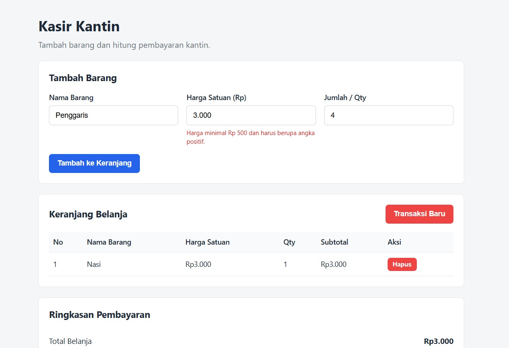
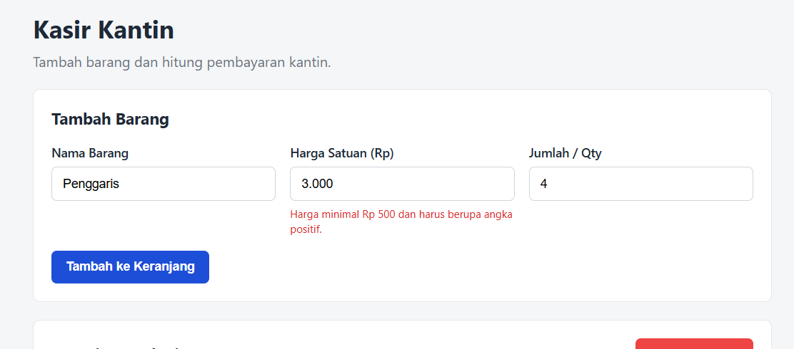
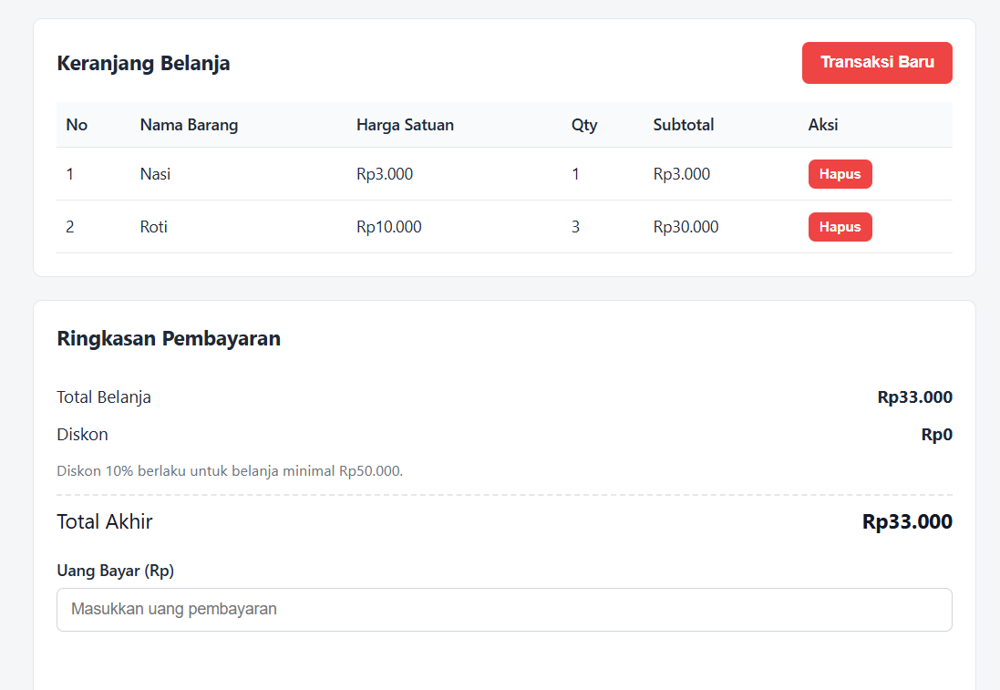

**Nama :** Stevan Immanuel Simbolon
**NIM :** 124140130
**Kelas Praktikum :** Pengembangan Aplikasi Web - RA

## Deskripsi

Aplikasi ini digunakan untuk mencatat barang yang dibeli di kantin dan menghitung total pembayaran. Aplikasi ini dibuat menggunakan HTML, CSS, dan Vanilla JavaScript

## Struktur File

- index.html: Struktur halaman, form input barang, tabel keranjang, dan ringkasan pembayaran.
- style.css : Tampilan halaman agar lebih rapi menggunakan Flexbox dasar.
- script.js : Logika validasi, keranjang, perhitungan, localStorage, dan reset transaksi.
- modul : Direktori yang menyimpan file-file latihan dari modul yang dibahas.
- gambar : Direktori yang menyimpan gambar-gambar yang digunakan di README.md.

## Fitur

1. Menambahkan nama barang, harga satuan, dan jumlah barang.
2. Memvalidasi input sebelum barang masuk keranjang.
3. Menampilkan subtotal setiap barang.
4. Menghitung total belanja secara otomatis.
5. Memberikan diskon 10% jika total belanja minimal Rp50.000.
6. Menghitung kembalian dari uang pembayaran.
7. Menghapus barang dari tabel keranjang.
8. Menyimpan keranjang di **localStorage**.
9. Mengosongkan keranjang melalui tombol **Transaksi Baru**.

## Validasi Input

- Nama barang harus memiliki minimal 3 karakter.
- Harga satuan minimal Rp500.
- Jumlah barang harus bilangan bulat minimal 1.
- Jika validasi gagal, pesan berwarna merah muncul di bawah input terkait.
- Jika validasi berhasil, input form dikosongkan.

## Cara Kerja **script.js**

1. Array **keranjang** digunakan untuk menyimpan data barang.
2. Saat halaman dibuka, data diambil dari **localStorage** menggunakan **JSON.parse**.
3. Fungsi **tampilkanKeranjang()** membuat baris tabel berdasarkan isi array.
4. Saat barang ditambah atau dihapus, data array disimpan kembali memakai **JSON.stringify**.
5. Fungsi **hitungTotal()** menjumlahkan semua subtotal dan menghitung diskon.
6. Fungsi **hitungKembalian()** membandingkan uang bayar dengan total akhir.
7. Tombol **Transaksi Baru** menghapus array dan data **localStorage**.

## Cara Menjalankan

1. Buka file **index.html** di browser.
2. Isi nama barang, harga, dan jumlah.
3. Klik tombol **Tambah ke Keranjang**.
4. Masukkan uang bayar untuk melihat kembalian.
5. Klik **Transaksi Baru** jika ingin mengosongkan transaksi.

## Screenshot Aplikasi

**1. Tampilan form input utama :**

**2. Tampilan validasi error :**

**3. Tampilan perhitungan kalkulator**

